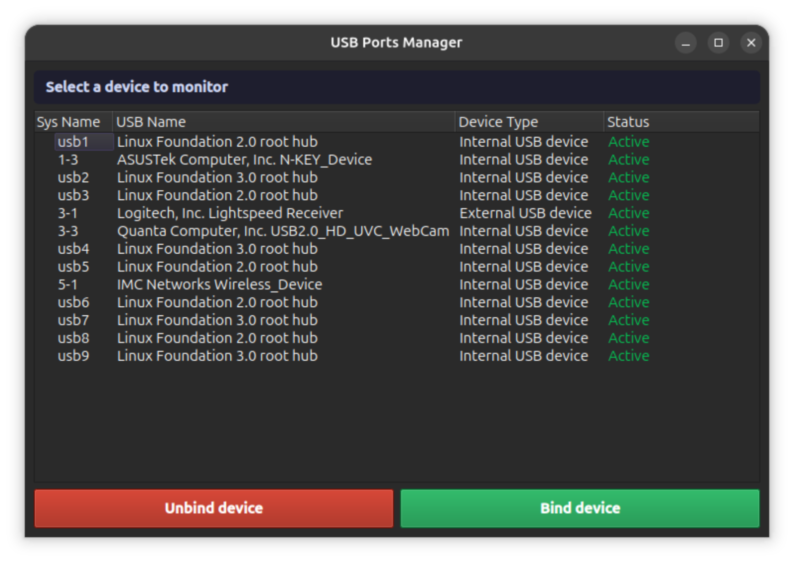
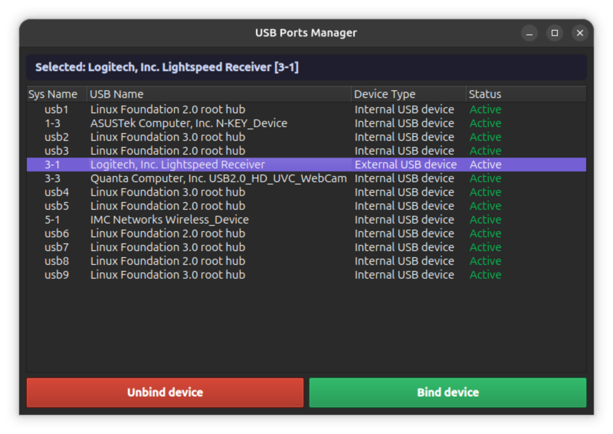
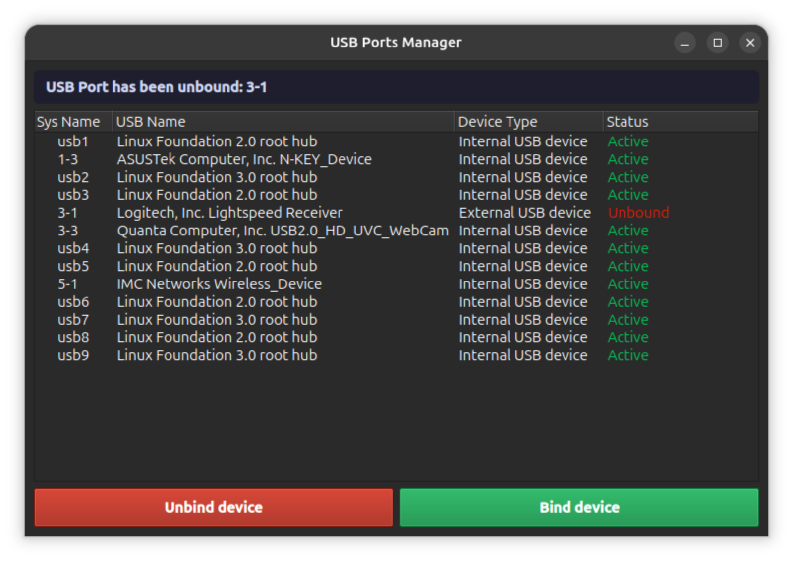
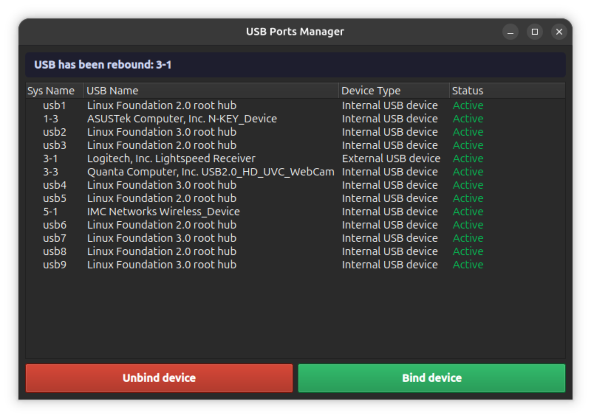

# USB-ports-controller
A project that focus on controlling external and internal USB ports and show there informations

## Screanshots:
**some of the UI used and how it works:**

Main UI:



chosing the device:



unbinding device:



rebinding device:




## Features
1. Monitor every USB port weither it is an internal or external ones. 
2. Unbind and bind ports by one click.
3. Easy UI to understand and use


## How to use
### First
**Install the libraries used:**

```py
pip install PyQt6 pyudev
```


### Second
**Run the project:**
```py
sudo python3 USBcontroller.py
```
*The project need the sudo permession because it binds and unbinds USB ports*